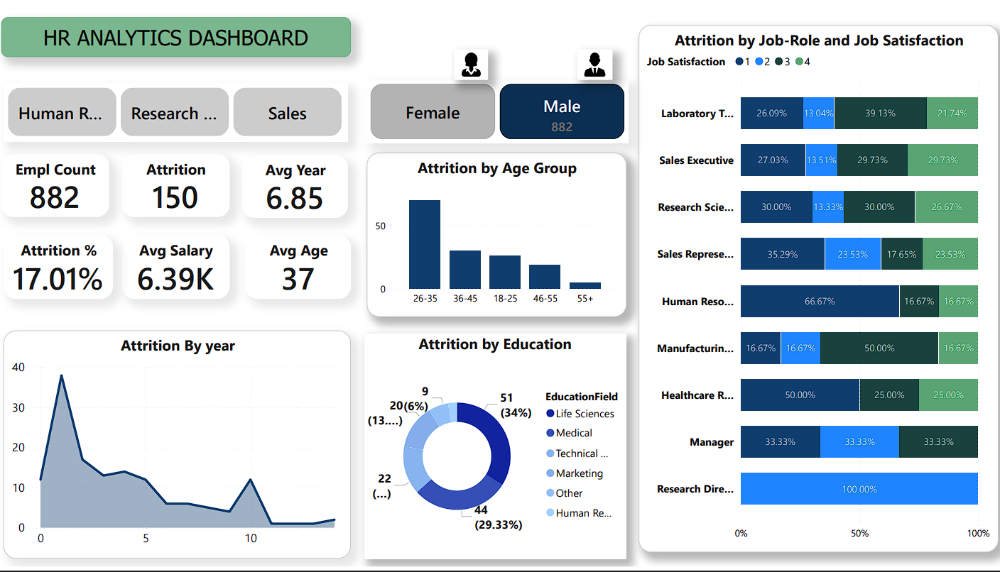
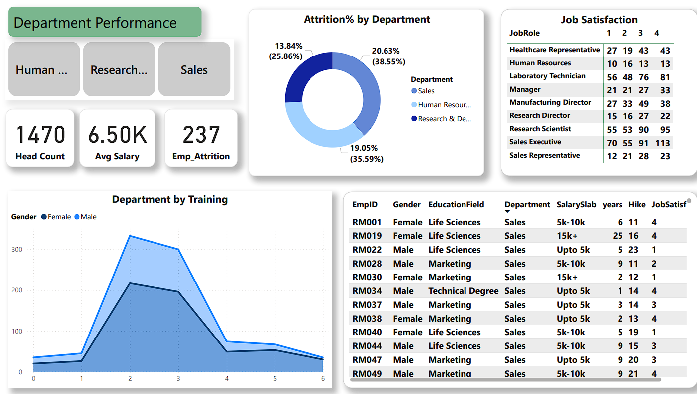
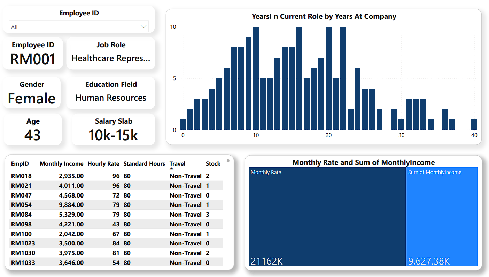

# HR Analytics Dashboard Project

## Overview
This project is an HR Analytics Dashboard designed to provide insights into employee data for better decision-making. The dashboard leverages the `HR_Analytics.csv` dataset and is visualized using Power BI (`HR_Analytics.pbix`). The project also includes supporting images for enhanced dashboard aesthetics.

**Live Dashboard:** [View Online](index.html)

## Features
- Interactive Power BI dashboard for HR analytics
- Visualizations include employee demographics, attrition, performance, and more
- Uses real HR data from `HR_Analytics.csv`
- Custom images for light and dark themes

## Project Structure
```
.git/                      # Git repository folder
HR_Analytics.csv           # Main dataset (CSV format)
HR_Analytics.pbix          # Power BI dashboard file
HR_Analytics.pdf           # Exported PDF report
Images/                    # Supporting images for dashboard visuals
    dash1.png
    Dash2.png
    female-worker (1).png
    female-worker (2).png
    Home.png
    moon.png
    sun.png
    worker (1).png
    worker.png
index.html                 # Live dashboard (HTML)
README.md                  # Project documentation
```

## Getting Started
### Prerequisites
- [Power BI Desktop](https://powerbi.microsoft.com/desktop/)

### Steps
1. Clone or download this repository.
2. Open `HR_Analytics.pbix` in Power BI Desktop.
3. If prompted, update the data source path to point to your local `HR_Analytics.csv` file.
4. Explore and interact with the dashboard.

## Data Source
- **File:** `HR_Analytics.csv`
- **Description:** Contains anonymized HR data including employee demographics, job roles, performance, and attrition information.

## Customization
- You can update the dataset or add new images in the `Images/` folder to personalize the dashboard.
- Modify the Power BI file as needed to add or change visualizations.


## Dashboard Views

### Home


### Department Performance


### Employee Performance


## License
This project is for educational and demonstration purposes only.

## Author
- Santosh Gorebal

---
Feel free to contribute or suggest improvements!
